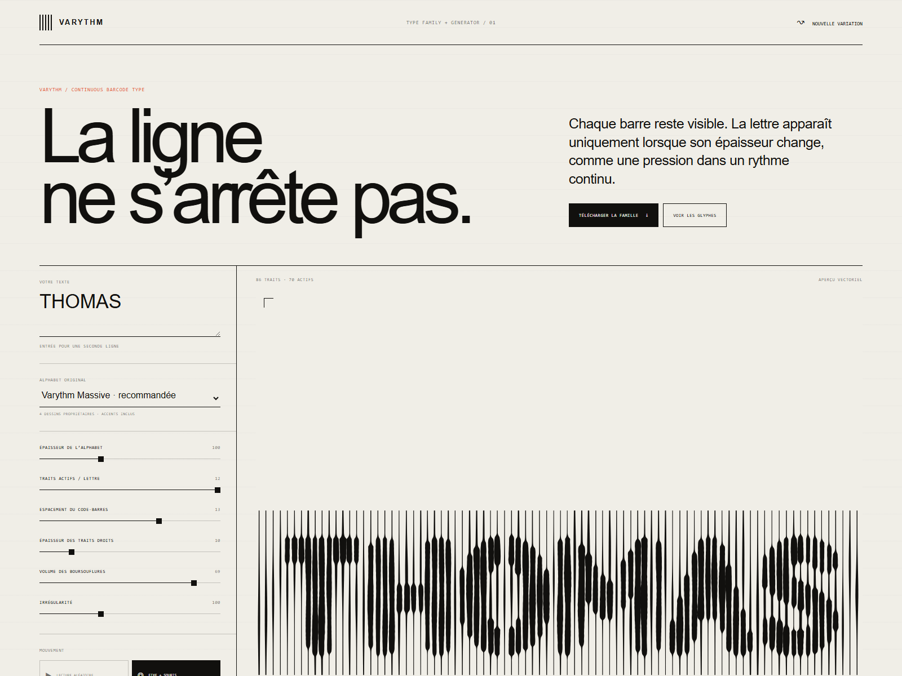
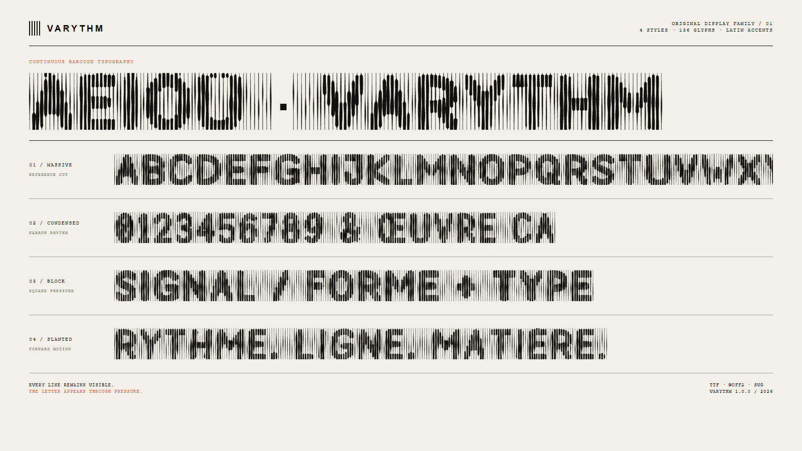

<div align="center">

# VARYTHM

### A typeface made of lines that never stop.

The letter is not cut out of the barcode. Every line remains visible; the
text appears only through local changes in thickness.

[](#download)
[](#font-family)
[](#character-set)
[](https://drmoussavie.github.io/VARYTHM/)

[Download the complete family](releases/Varythm-1.0.0.zip) · [Open the live generator](https://drmoussavie.github.io/VARYTHM/)

</div>



## The idea

Varythm is a unicase display family and a generative typographic instrument.
Its continuous vertical lines behave like a living barcode: each line carries
a subtle swelling, while selected lines expand further where they cross the
hidden geometry of a letter.

The interactive version adds seeded variations and a mouse-driven pressure
field. The installable family freezes that system into reproducible glyphs for
headlines, posters, motion titles and experimental identities.



## Download

The complete release is available in
[`releases/Varythm-1.0.0.zip`](releases/Varythm-1.0.0.zip). It contains:

- four installable TrueType fonts;
- four optimized WOFF2 webfonts;
- one CSS webfont file;
- an individual SVG specimen for every Massive glyph;
- the license and project documentation.

For a desktop installation, download the ZIP, open the `fonts` directory and
install the `.ttf` files. For the web, copy the `.woff2` files and adapt
[`fonts/varythm.css`](fonts/varythm.css).

## Font family

| Style | Personality | File |
| --- | --- | --- |
| **Varythm Massive** | Dense, rounded, the reference configuration | [`TTF`](fonts/Varythm-Massive.ttf) · [`WOFF2`](fonts/Varythm-Massive.woff2) |
| **Varythm Condensed** | Narrower rhythm for longer titles | [`TTF`](fonts/Varythm-Condensed.ttf) · [`WOFF2`](fonts/Varythm-Condensed.woff2) |
| **Varythm Block** | Heavier mass with square terminals | [`TTF`](fonts/Varythm-Block.ttf) · [`WOFF2`](fonts/Varythm-Block.woff2) |
| **Varythm Slanted** | Forward pressure and oblique movement | [`TTF`](fonts/Varythm-Slanted.ttf) · [`WOFF2`](fonts/Varythm-Slanted.woff2) |

Varythm works best as a display face at large sizes. It is intentionally
unicase: lowercase input uses the same graphic language as the capitals.

## Character set

```text
ABCDEFGHIJKLMNOPQRSTUVWXYZ
abcdefghijklmnopqrstuvwxyz
0123456789

À Á Â Ã Ä Å Æ Ç È É Ê Ë Ì Í Î Ï Ñ Ò Ó Ô Õ Ö Œ Ù Ú Û Ü Ÿ
à á â ã ä å æ ç è é ê ë ì í î ï ñ ò ó ô õ ö œ ù ú û ü ÿ

! ? . , : ; - ' " / \ & + = _ ( )
```

Every character from the reference style is also exported individually in
[`glyphs/svg`](glyphs/svg). Filenames use their Unicode code point, making the
set easy to browse and reuse in specimen layouts.

## Interactive generator

Serve this directory through any static HTTP server and open `index.html`:

```bash
python -m http.server 4173
```

The generator provides controls for active lines, barcode spacing, source
weight, swelling volume, irregularity, seeded playback, mouse diffusion,
mouse intensity and lateral displacement. Compositions can be exported as SVG
or PNG.

## Build the font

The binaries are generated from the same original geometry used by the browser
tool. No system or third-party font outline is sampled, embedded or converted.

Requirements: Python 3.10+, `fontTools`, Brotli support and Node.js 18+.

```bash
python scripts/build_font.py
```

This command rebuilds the TTF/WOFF2 family, the individual SVG glyphs and the
release ZIP from `alphabet.js`.

## Project structure

```text
alphabet.js                  Original vector skeletons and style profiles
app.js                       Interactive barcode renderer
fonts/                       Installable TTF and WOFF2 family
glyphs/svg/                  One SVG per Massive glyph
scripts/build_font.py        Reproducible font build
scripts/export-glyph-data.js Bridge between browser source and font build
docs/images/                 README screenshots
releases/                    Ready-to-download packages
```

## Authorship and license

The glyph geometry was drawn specifically for Varythm. Its technical
provenance is documented in [`ORIGINAL-ALPHABET.md`](ORIGINAL-ALPHABET.md).

This public repository is **source-available, not open source**. Personal
evaluation is permitted; commercial use, embedding, redistribution and
derivative releases require prior written permission. Read
[`LICENSE.md`](LICENSE.md) before using the font or generator.

© 2026 SAS LHOMME DEVELOPMENT AND INNOVATION.
